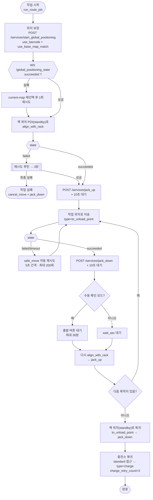
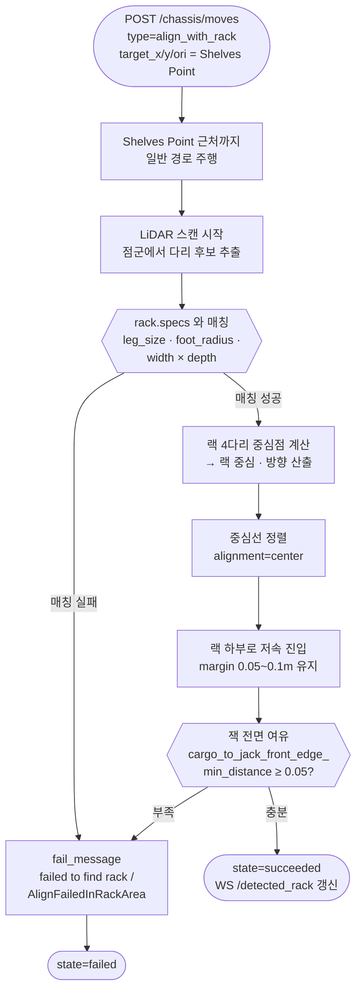
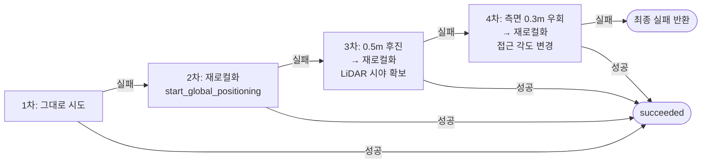

# LiDAR 감지 → 랙(선반) 인식 · 이송 Flow

RCS-Basic + AutoXing crawler(S300/S600) 기준.
근거: [AxBot REST Book](https://autoxingtech.github.io/axbot_rest_book/) + `BackEnd/app/services/jack_service.py`

---

## 0. 전제 조건 (이게 안 맞으면 랙을 절대 못 찾음)

| 항목 | 설정 위치 | 값 |
|---|---|---|
| 랙 물리 스펙 | `PATCH /system/settings/user` → `rack.specs` | S300: 0.765×0.765 / S600: 0.83×0.87 (`app/constants/rack_specs.py`) |
| Shelves Point | 맵 overlay feature | `type="34"`, `subtype="rack"`, `hasFixedLegs=false`, `dockViaDirection="front"` |
| overlay 반영 | overlay PATCH 후 | `POST /chassis/current-map` 재선택 (overlays_version 갱신) |

> `rack.specs`는 **사용하는 사이즈 종류만** 등록. 여러 spec이 등록되면 펌웨어가 LiDAR 측정값을 엉뚱한 spec에 매칭해 실패하는 사례 있음.

---

## 1. 전체 흐름 (rack_pickup 모드)

---

## 2. align_with_rack 내부 — LiDAR가 랙을 인식하는 구간

**모니터링 토픽**
- `/detected_rack` — 랙 감지 여부/좌표
- `/jack_state` — `jacking_up` / `jacking_down` / `hold`
- `/robot_model` — 잭 업 시 풋프린트가 랙 크기로 확장됨

---

## 3. 랙 인식 실패 시 재시도 (`align_with_retry`, 최대 4회)

| 실패 코드 | 원인 | 대응 |
|---|---|---|
| `failed to find rack` | POI type이 34가 아님 / 랙 부재 / spec 불일치 | overlay·rack.specs 점검 |
| `AlignFailedInRackArea` | 진입 각도·시야 문제 | 후진·측면 우회 재시도 |
| `MoveTimeout` | 경로 막힘 | safe_move 재시도 |
| `ChargeRetryCountExceeded` | 도킹 실패 | 사전 접근 POI(`<충전소명>-1`) 경유 |

---

## 4. work_mode 별 분기

| 모드 | 랙 인식(align_with_rack) | 이송 move type | 잭 조작 |
|---|---|---|---|
| `rack_pickup` | 사용 (LiDAR 랙 정렬) | `to_unload_point` | pickup에서 up, dropoff에서 down |
| `delivery_no_rack` | 미사용 | `standard` | pickup up / dropoff down |
| `simple_move` | 미사용 | `standard` | 없음 |
